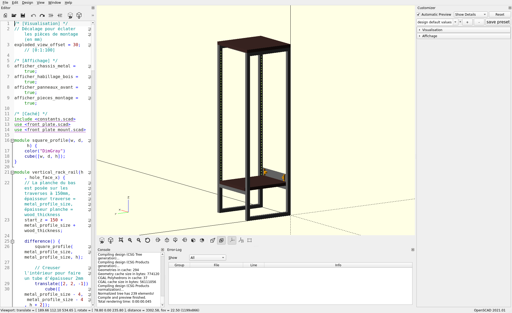
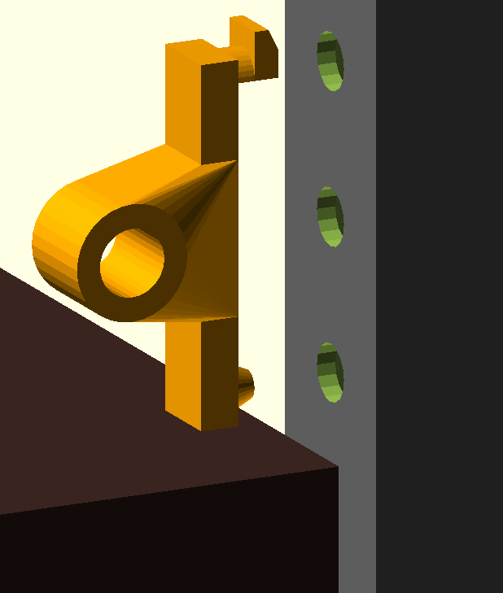

= Homelab Mini Rack Project

== Context
This is a personal project aimed at learning and practicing multiple maker disciplines: woodworking, 3D printing, and soldering. A huge thanks to the **Y-FabLab** community for the help and resources that make this project possible!

== Goal of the Project
The objective is to build a small rack for a home lab. Instead of a generic server rack, this project aims for a highly custom vintage/industrial aesthetic, combining raw steel square tubes with dark wooden
panels. 

It is designed to cleanly house and manage small devices:
* Raspberry Pis
* GMKTec mini PCs
* Network switches
* A dedicated technical zone for power management (power strips, 8x USB charger
  hubs, and specific power bricks for mini PCs).

== The First Attempt: `stackable-3d-prints`
The initial version of this project was entirely based on 3D printed stackable modules. However, I decided to abandon it and pivot to a new architecture due
to several critical limitations:
* **Thermal Management**: Stacked closed plastic boxes provided poor airflow
  for the SBCs.
* **Cable Management**: Routing network and power cables through the stack
  became an absolute nightmare.
* **Accessibility**: Accessing or swapping a device in the middle of the stack
  meant dismantling everything above it.

== The Current Version: `rack_10inches`
To solve the previous issues, the project evolved into a custom hybrid
metal/wood rack.

=== Design & Style
The design leverages an industrial and vintage style. The skeleton is made of
15x15mm steel square profiles, dressed with wooden panels (sides, top, and
base). This creates an open-frame internal structure that guarantees excellent
airflow and massive space in the back for cables, while looking like a stylish
piece of furniture.

=== Dimensions & Standard
Instead of the massive 19-inch standard, this rack is built around the
**10-inch rack standard**, which is the perfect footprint for Raspberry Pis and
mini PCs. The internal height is 22U (approximately 1 meter tall). 

The inner faces of the steel profiles are drilled with standard EIA-310 rack
holes.

=== The Toolless Mounting Clip
One of the major innovations in this design is how the front plates attach to
the steel frame. Instead of tapping holes directly into the steel to screw the
panels, I designed a custom 3D-printable mounting bracket.
* It features a snap-fit conical peg at the bottom.
* It features a half-cylinder peg with a hook at the top.
* **How it works:** You tilt the printed piece to insert the top hook into the
  chassis hole, then pivot it down. The bottom peg snaps into the lower hole,
  locking the piece securely to the frame without a single screw on the chassis
  side. The front plates are then screwed into an M5 heat-set threaded insert
  melted into the bracket.

=== Modeling with OpenSCAD and Antigravity
The entire project is parametrically modeled using **OpenSCAD**, allowing for
precise, code-driven adjustments of all dimensions and components. I 
collaborated with the Antigravity AI agent to assist in iterating on the
design, precisely calculating the EIA-310 hole spacing, and engineering the
complex geometric `hull()` shapes for the toolless mounting clips.

